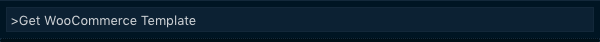
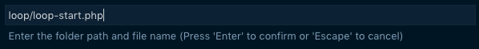
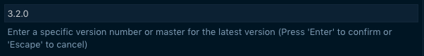
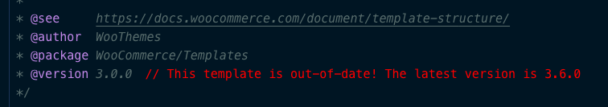
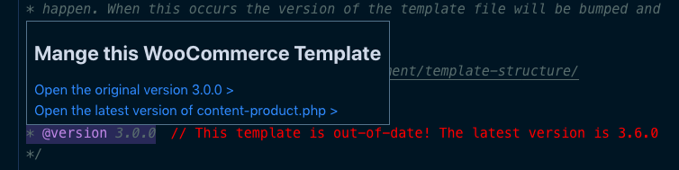

# WooCommerce Template Manager
Easily compare you current custom WooCommerce templates to the original plugin templates. No more searching through github to find the WooCommerce template files you need! 

## Features
Open a specific version of a WooCommerce template file using the command "Get WooCommerce Template" in the command palate. Fill in the required information in the input prompts and the extension will open the specified file in an untitled document right in vscode.







When a WooCommerce template file is opened in vscode, the extension will provide an alert (to the right of the version nummber) indicating whether the template is up-to-date or requires updates.



Customize the color of this alert in the settings menu using:
```
"workbench.colorCustomizations": {
    "wooTemplates.alert": "#ffffff",
    "wooTemplates.info": "#000000",
}
```

Open a diff from a custom WooCommerce template by hovering over the version number and selecting the diff option you would like to open. You can either diif with the original document of the same version, or diff with the latest version.

